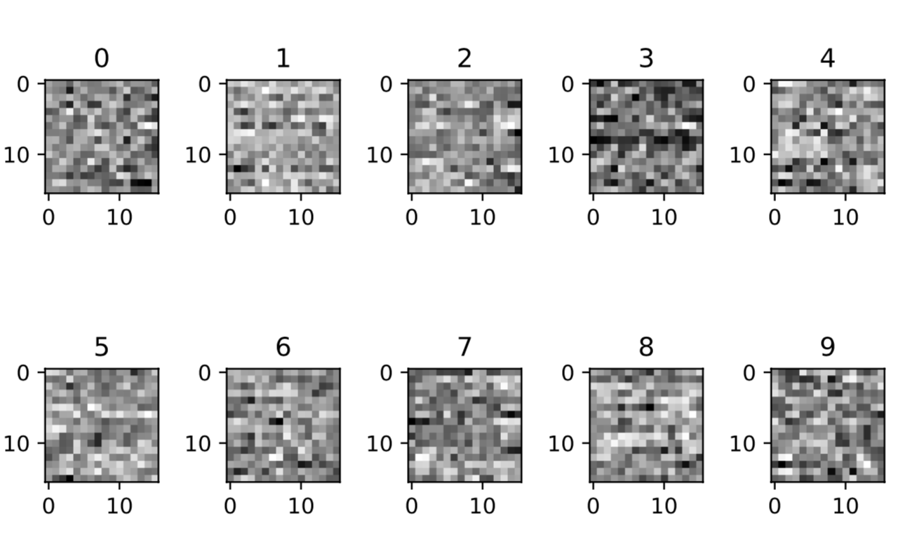

# CNN for MNIST (transcripted from the original document on 12/15/2018)
## Network structure:
* Input➔Convolutional layer 1 ➔Batch Norm➔ReLu➔MaxPool
* ➔Convolutional layer 2➔Batch Norm➔ReLu
* ➔Fully connected layer➔ReLu
* ➔dropout➔softmax➔output
# Hyper parameters:
* Optimizer: Adadelta
* Learning rate: 3
* Lowest error on test set: 0.80% (accuracy=99.20%) 
* Total parameters: 7754

### Convolutional layer 1:
12 channels, kernel=5, stride =1 pixel, no padding (to save # of parameters)
### Convolutional layer 2:
16 channels, kernel=5, stride =1 pixel, no padding
### Other Hyperparameters
Epochs: 10 (to avoid overfitting issues)
Num of classes of labels: 10 
Batch size: 60

## Notes
1. I selected convolutional layer as it can avoid issues like miss-centered number because fully connected layer maps all pixels while a convolutional layer doesn’t have to. 
1. I tried three kernel sizes (3, 4, 5), and it seems larger kernel size gives better accuracy, while it also introduces more parameters. 
1. I increased the channel number for each convolutional layer and reduce one fully connected layer from the example to match the requirements of parameter size. I also add a batch normalization to scale the activations. 
1. For the optimizer, I tried Adam, SGD, Adagrad, and Adadelta, with different learning rate. It seems different optimizer has their own best learning rate, and for Adadelta, learning rate is set at 3, although it seems Adadelta has its own process to adjust/adapt the real learning rate.
1. I used CUDA as the device to train the NN (so code was modified because of some hardware warning from the example code), with epoch=10 and batch size =100. The highest accuracy is 99.20%.

## Weights for fully connected layer (16*16)

## Sample results:
1. Percent of training images misclassified: 40.63166666666667 % Test Accuracy of the model on the 10000 test images: 99.2 % ** Percent of testing images misclassified: 0.7999999999999972 %
1. Percent of training images misclassified: 40.401666666666664 % Test Accuracy of the model on the 10000 test images: 99.16 % ** Percent of testing images misclassified: 0.8400000000000034 %
1. Percent of training images misclassified: 40.721666666666664 % Test Accuracy of the model on the 10000 test images: 99.14 % ** Percent of testing images misclassified: 0.8599999999999994 %
